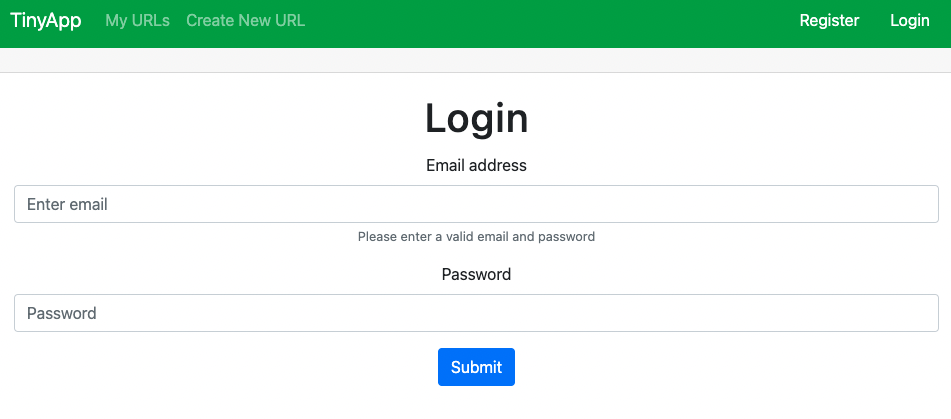
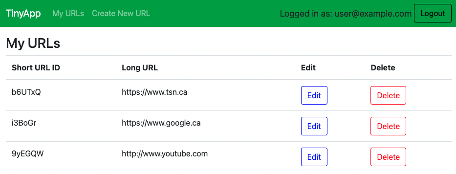
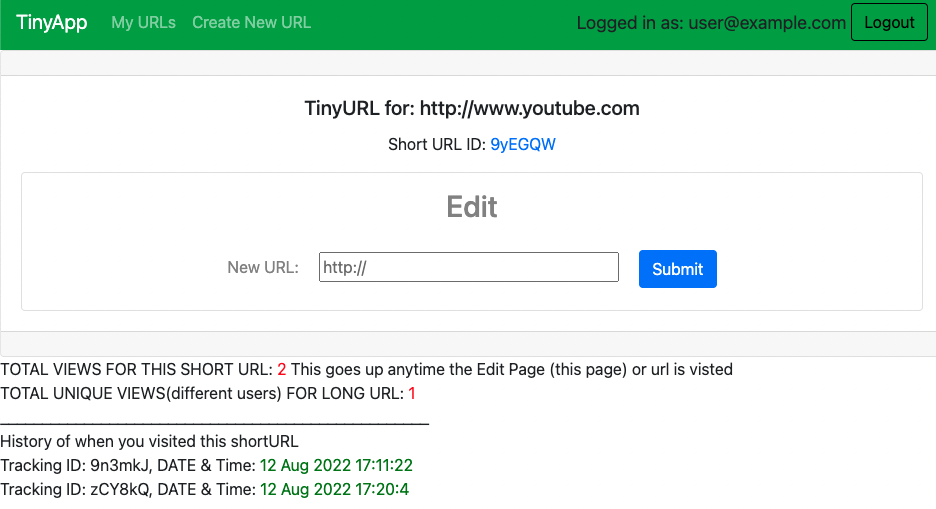
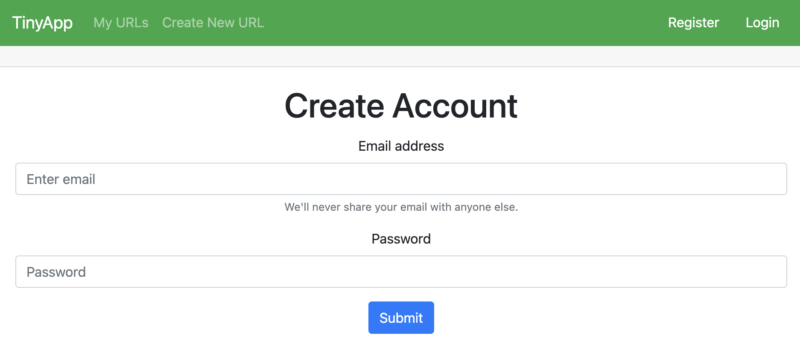

# TinyApp Project

TinyApp is a full stack web application built with Node and Express that allows users to shorten long URLs (à la bit.ly).

## Final Product

## Dependencies

- Node.js
- Express
- EJS
- bcryptjs
- cookie-session
- Mocha
- Chai
- method-override

## Getting Started

- Install all dependencies (using the `npm install` command).
- Run the development web server using the `node express_server.js` command.

## Features

- This small app utilizes to Express to handle HTTP requests to the server. 
- The web pages are rendered server side using EJS. 
- The end user is assigned a session cookie on successful login and registration. 
- The end user's passwords are hashed using bcryptjs and stored in a database. 
- Method-override module is used to add in PUT and Delete requests/form submissions
- A session cookie is assigned to unregistered users to track visits to urls
